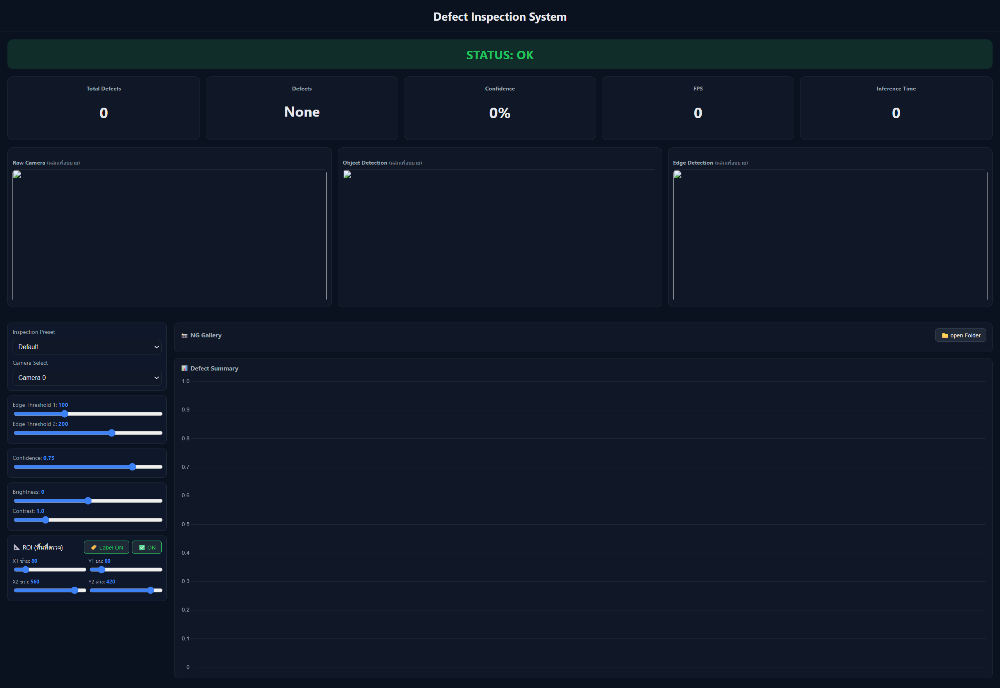
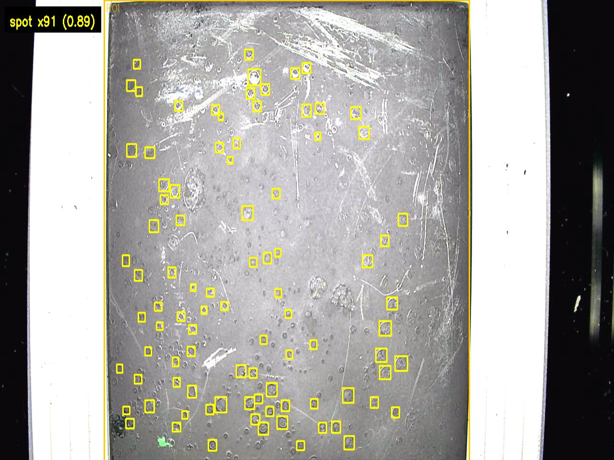

# AI-Based Metal Surface Defect Detection

## Overview

An AI-powered industrial inspection system for automatic metal surface defect detection using Ultralytics YOLO, OpenCV, FastAPI, and a real-time dashboard.

## Features

- Real-time defect detection
- YOLO-based AI model
- FastAPI backend
- Live dashboard
- Detection statistics
- Surface defect classification
- Model evaluation (Precision, Recall, mAP)

## Technologies

- Python
- FastAPI
- OpenCV
- Ultralytics YOLO
- HTML
- CSS
- JavaScript

## Project Structure
Project_Defect_System/
└── defect_system/
    └── backend/
        ├── main.py
        ├── config.json
        ├── requirements.txt
        ├── best.pt
        ├── static/
        │   └── dashboard.html
        └── ng_images/

## Installation

### 1. Clone the repository

```bash
git clone https://github.com/krittipan2/ai-metal-surface-defect-detection.git
```

### 2. Navigate to the project directory

```bash
cd ai-metal-surface-defect-detection
```

### 3. Create a virtual environment (Optional)

**Windows**

```bash
python -m venv .venv
.venv\Scripts\activate
```

**Linux / macOS**

```bash
python3 -m venv .venv
source .venv/bin/activate
```

### 4. Install the required packages

```bash
pip install -r requirements.txt
```

### 5. Run the application

```bash
uvicorn main:app --reload
```

### 6. Open the dashboard

Open your browser and visit:

```
http://127.0.0.1:8000
```


## Usage

1. Launch the FastAPI application.

```bash
python main.py
```

2. Open your web browser and navigate to:

```
http://127.0.0.1:8000
```

3. Upload an image or connect a camera.

4. The system automatically detects metal surface defects using the trained Ultralytics YOLO model.

5. Detection results, confidence scores, and real-time statistics are displayed on the dashboard.


## Model Performance

The model was evaluated using standard object detection metrics:

| Metric | Value |
|---------|------:|
| Precision | 86.5% |
| Recall | 87.4% |
| mAP@50 | 90.5% |
| mAP@50-95 | 65.5% |


## Screenshots

### Dashboard



### Detection Result



### Statistics


## Future Improvements

- Improve detection accuracy with larger datasets.
- Support additional defect categories.
- Deploy on edge devices such as NVIDIA Jetson or Raspberry Pi.
- Integrate SQL database for inspection history.
- Add user authentication and role management.
- Export inspection reports in PDF and Excel formats.

## Author

**Krittipan Kraumangkorn**

Bachelor of Engineering (Precision Engineering)

Suranaree University of Technology

Email: krittipan2@gmail.com

GitHub: https://github.com/krittipan2


## License

This project is licensed under the MIT License.
